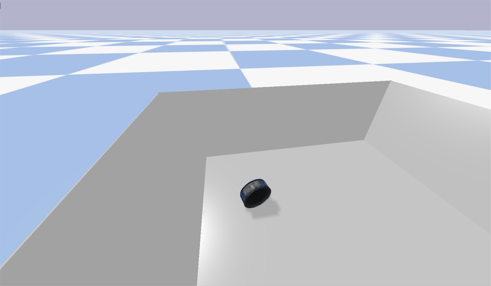

# bullet_load_urdf
using pybullet to load urdf model with texture

# run
> python load_urdf.py

You can see the following window:

# more urdfs
This code uses a model from YCB, if you are interesting with more urdf models, please contact me with <dexinwang@mail.sdu.edu>.
